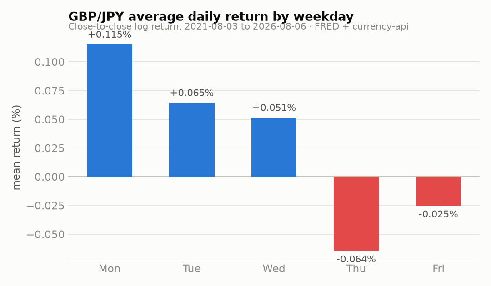
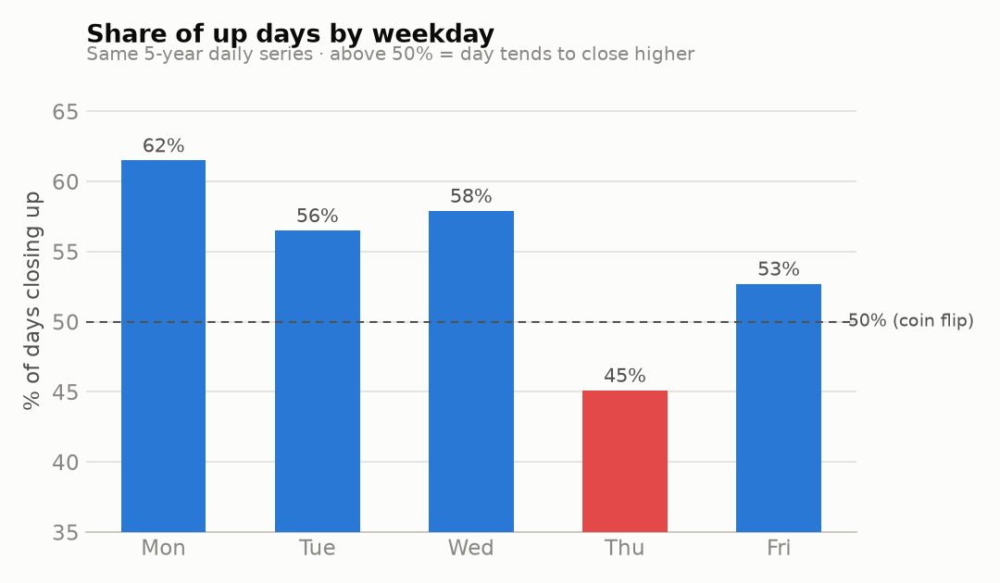
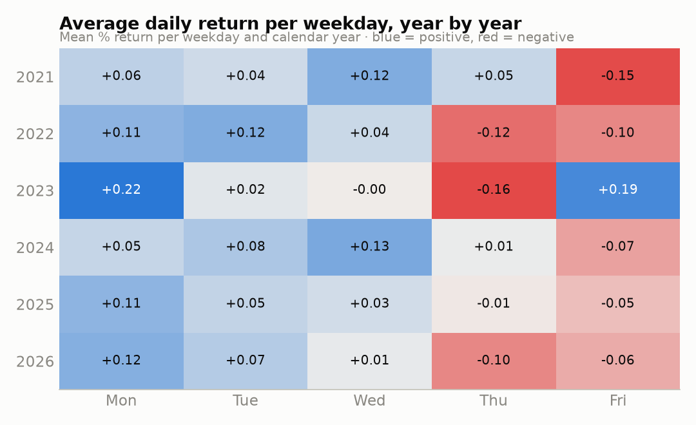
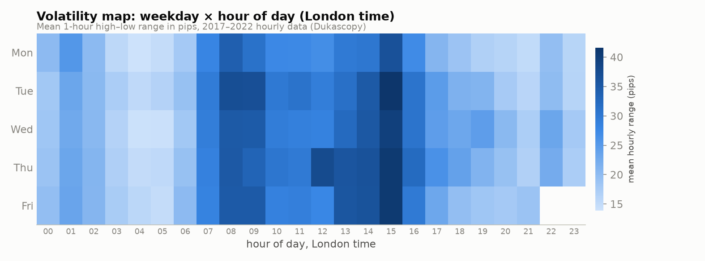
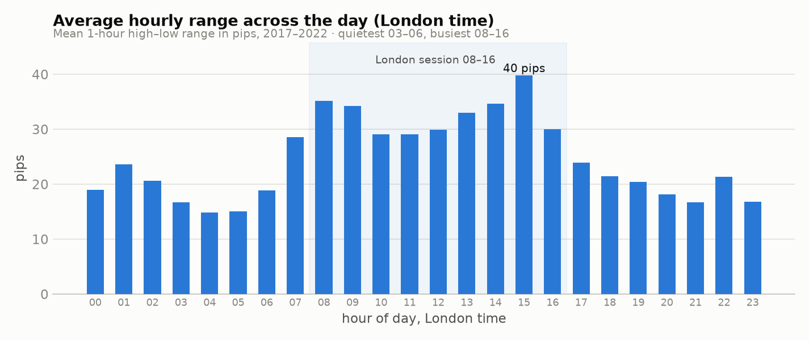

# GBP/JPY — Day-of-Week & Session Edge Study (2021–2026)

**Question:** Over the past five years, on which days of the week — and at which times of day (London time) — has GBP/JPY been most stable and most profitable, and is there a usable edge?

**Short answer:**

1. **Monday is the strongest day to be long.** Over Aug 2021 – Aug 2026, Mondays averaged **+0.115%** with **61.5% of Mondays closing up** (t-stat 3.0), and the effect was positive in **all six calendar years**. It also shows up independently in a separate 2017–2022 dataset (59.7% up, t = 2.5). Monday is simultaneously the *calmest* day (smallest average range, smallest tail moves) — the rare combination of "most profitable" and "most stable."
2. **Thursday and Friday are the weak days.** Thursday is the only day with a negative average return in both datasets (only ~45% of Thursdays close up) and has the biggest average range and fattest tails — the worst stability-to-reward combination. Friday drifts lower in *every* intraday session on 10 years of hourly data.
3. **Best hours (London time): 08:00–16:00, with peaks at 08–09 and 14–16.** The quietest, choppiest hours are 03:00–06:00. If you trade the London session you are already sitting in the pair's highest-energy window; Tuesday–Thursday 08:00–16:00 is where the big ranges live.

Everything below backs these up with numbers, then covers the caveats (which matter a lot), prop-firm automation rules, and how we'll work together on live trades.

---

## Data used (and why it's stitched together)

No single free source covers 5 years of GBP/JPY OHLC to today, so the study triangulates three independent sources; all files are committed under `data/` so everything is reproducible:

| Dataset | Coverage | Granularity | Source |
|---|---|---|---|
| Dukascopy-derived OHLC (`ejtrader_gbpjpy_d1/h1.csv`) | Nov 2012 – Mar 2022 | daily + 1-hour | [ejtraderLabs/historical-data](https://github.com/ejtraderLabs/historical-data) |
| Fed H.10 noon-NY rates (`fred_*.csv`) | through Dec 2025 | daily | FRED `DEXUSUK` × `DEXJPUS` cross, via [forex-centuries](https://github.com/unbalancedparentheses/forex-centuries) |
| currency-api snapshots (`capi_gbpjpy_2026.csv`) | Jan – Aug 2026 | daily | [fawazahmed0/currency-api](https://www.npmjs.com/package/@fawazahmed0/currency-api) (midnight-UTC snapshots, shifted −1 day to label trading days) |

Cross-check on the overlap window: the FRED cross vs the Dukascopy closes agree with **correlation 0.995** and mean absolute difference 0.11% (explained by the different daily fixing times). The hourly file's timestamps are MT-server time (EET); all intraday analysis converts to **London time** (server − 2h).

- The **5-year day-of-week return stats** use the stitched daily series: 1,259 trading days, 2021-08-03 → 2026-08-06.
- The **range/session/hourly stats** use the Dukascopy OHLC (full 2012–2022 and a 2017–2022 recent cut). This is the study's main limitation: intraday structure is measured on data ending Mar 2022. Session *volatility structure* (which hours are busy) is very persistent across years — it's driven by market opening hours, not regimes — but treat intraday *directional* numbers as weaker evidence than the daily ones.

## Finding 1 — the Monday effect (long bias)

Five-year daily stats by weekday:

| | Mon | Tue | Wed | Thu | Fri |
|---|---|---|---|---|---|
| Mean return | **+0.115%** | +0.065% | +0.051% | **−0.064%** | −0.025% |
| % up days | **61.5%** | 56.5% | 57.9% | **45.1%** | 52.7% |
| t-stat | **3.0** | 1.7 | 1.5 | −1.5 | −0.6 |
| Mean daily range (pips, 2017–22 OHLC) | **122** (lowest) | 133 | 127 | **137** (highest) | 129 |
| 95th-pct range (pips) | 220 | 240 | 224 | **278** | 246 |
| Worst single-day drop (2017–22) | −2.2% | −1.6% | **−3.6%** (Wed) | −1.7% | −1.9% |

Year-by-year consistency — the Monday column is positive in all six years; Thursday/Friday are the persistent red columns:

Naive backtest (hold prior close → close, no leverage, no costs; in-sample = 2021–2024, out-of-sample = 2025–2026):

| Strategy | IS win rate | IS ann. Sharpe | OOS win rate | OOS ann. Sharpe |
|---|---|---|---|---|
| **Long every Monday** | 60.8% | 1.35 | **62.8%** | **1.65** |
| Short every Thursday | 54.7% | 0.73 | 55.6% | 0.58 |
| Short every Friday | 46.6% | 0.13 | 48.8% | 0.76 |

The Monday-long effect is the only one that is strong, stable and significant in both halves. A plausible mechanism: 2021–2026 was a persistent yen-carry / yen-weakening regime, and weekend-gap risk premium + fresh weekly positioning tends to get put on early in the week. Which is also the warning — see caveats.

## Finding 2 — where the volatility lives (London time)

- **Busiest hours:** 08:00–09:00 (London open, ~35 pips/hour) and 13:00–16:00 (NY morning/fix window, peaking ~40 pips at 15:00). Tuesday and Thursday afternoons are the hottest cells on the map.
- **Quietest hours:** 03:00–06:00 London (~15 pips/hour) — late-Asia dead zone. Spreads matter most here and breakouts are least reliable.
- **Session behaviour by weekday** (10 years of hourly data, net drift in pips):
  - **Friday is negative in every session** — Asia −5.8, London AM −5.8 (only 44.6% up), NY overlap −3.6, late NY −5.4. GBP/JPY has systematically faded on Fridays (profit-taking / de-risking into the weekend).
  - Wednesday London AM has the most consistent small positive drift (+2.6 pips IS, +2.7 OOS).
  - Monday's daily gain does *not* come from one session — it accrues gradually (and partly in the Sunday-open gap), so the cleanest expression of it is simply the full-day hold.

## The edge, stated carefully

- **Best combination of stability + profitability in 5 years of data: long bias on Monday, traded during the London session.** ~62% historical up-rate, smallest ranges, smallest tails, positive every year, survives out-of-sample.
- **Second-order filters:** be more skeptical of long setups on Thursday/Friday (the only negative-drift days; Thursday also has the fattest tails), and avoid initiating in the 03:00–06:00 dead zone. Friday London-morning weakness is real but averages only ~6 pips — that's *bias* territory, not a standalone trade, since GBP/JPY spreads run 2–4 pips.
- **What this is:** a probability tilt of a few percentage points, useful for sizing/filtering discretionary setups. **What this is not:** a money machine. ~62/38 on Mondays still means 4 losing Mondays in 10.

### Caveats you should actually read

1. **Regime dependence.** 2021–2026 was one long yen-weakening regime (GBP/JPY ~150 → ~213). A weekday long-bias measured inside an uptrend partially *is* the uptrend. If the BoJ regime turns (fast unwinds like Aug 2024), the Monday tilt can invert — day-of-week effects in FX are known to decay/flip across decades.
2. **Multiple comparisons.** Testing 5 days × directions × sessions = dozens of hypotheses; a couple will always look good by luck. Monday-long is the one that clears the bar on significance, year-by-year consistency, *and* an independent dataset — that's why it leads the report — but the smaller effects (Wed AM drift, Fri fade) could be noise.
3. **No costs modeled.** Backtests exclude spread/swap. Daily-hold effects (~20 pips avg) survive realistic costs; the session effects (3–7 pips) mostly don't.
4. **Intraday data ends Mar 2022** (see data section). Hour-of-day *volatility* structure is stable; intraday *direction* numbers are the weakest part of the study.
5. **News overrides seasonality.** NFP Fridays, UK/JP CPI, BoE/BoJ days blow through any weekday tendency. The BoJ's habit of moving on Fridays is part of why Friday is fat-tailed.

## Prop firms & automated trading

You're right that Claude can't and shouldn't place trades for you, and on funded accounts it mostly isn't allowed anyway. The landscape (verify the current ToS of whichever firm you use — these change):

- **FTMO:** allows EAs/algos you built yourself; bans copy-trading someone else's system, HFT/latency arbitrage, and group "account passing" services. Using an AI as an *analysis assistant* is fine — the human must click the button.
- **FundedNext, Funding Pips, The5ers, E8, etc.:** policies range from "EAs allowed with restrictions" to "prohibited during evaluation." Almost all ban third-party/copy EAs and anything exploiting demo-server quirks (tick scalping, gap arbitrage, reverse hedging across accounts).
- **Practical rule:** *decision support* (what this session does — analysis, probability framing, risk math) is universally fine; *unattended execution* usually is not, and no firm allows outsourcing trades to a third party. So the workflow below keeps you as the executor.

## How we'll work together on live trades

When you share a chart + idea, I'll give you a structured read, not a yes/no:

1. **Technical:** trend/structure on your timeframe vs one higher, key levels, momentum, where your stop and target sit relative to average ranges above (e.g. a 30-pip stop inside the 15:00 hour is inside one candle's average range — that's a coin flip, not a setup).
2. **Fundamental/calendar:** upcoming UK/US/JP releases, BoE/BoJ posture, risk sentiment (GBP/JPY is a risk-on/risk-off proxy).
3. **Seasonality overlay from this study:** does the day/hour tilt with you or against you?
4. **Verdict as probability + risk framing:** "conditions lean favorable/unfavorable because X, Y; invalidation is Z" — with the honest reminder that no single trade is predictable and the study above only ever shifts odds by a few points.

To re-run this study later: `python analysis.py && python charts.py` inside `forex-analysis/` (see `data/README.md` for how to refresh each source).
